# react-native-openai-translator

Not just a translator, and more than chat.

- Inspired by [OpenAI Translator](https://github.com/yetone/openai-translator)
- Powered by [OpenAI ChatGPT API](https://platform.openai.com/docs/api-reference)
- Implemented by [React Native](https://reactnative.dev/)

## Instruction

<table>
  <tr>
    <td>Modes - Case of translate English Word into Chinese.</td>
    <td>Chats - Add and customize any chat by youself.</td>
    <td>Discover - Discover something new about OpenAI and GPT.</td>
    <td>Me - Locate and manage all of what you created.</td>
    <td>Settings - Light</td>
  <tr>
    <td>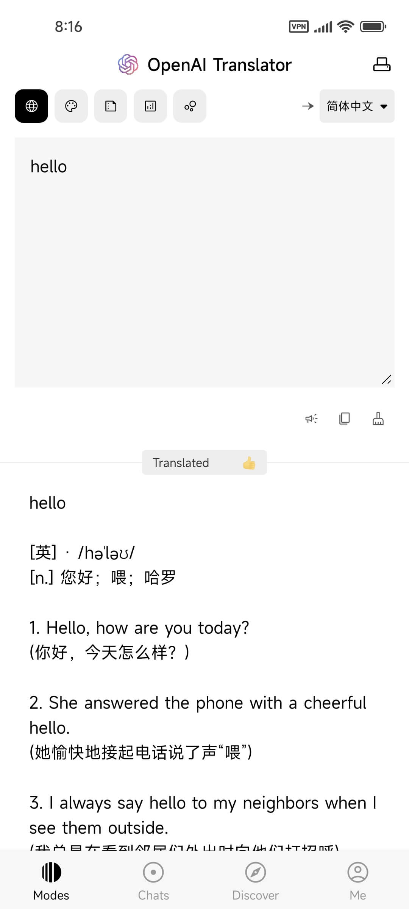</td>
    <td>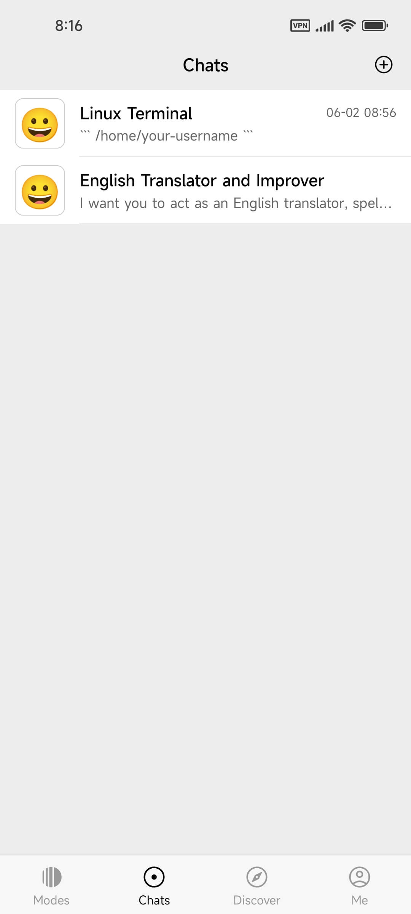</td>
    <td>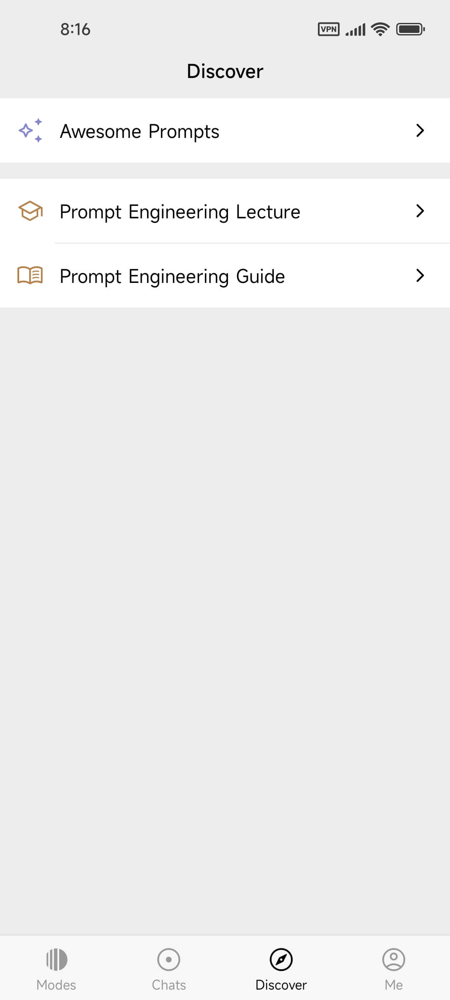</td>
    <td>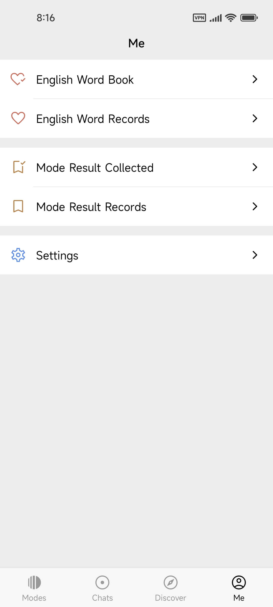</td>
    <td>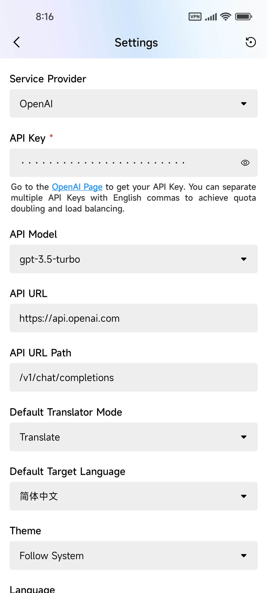</td>
  </tr>

  <tr>
    <td>Modes - Case of polishing English Word into English.</td>
    <td>Mode Chat - Continuously chat with polishing mode reuslt.</td>
    <td>Share - By capturing messages view and save into album.</td>
    <td>Share - By copy plain messages text into any other app.</td>
    <td>Settings - Dark</td>
  </tr>
  <tr>
    <td>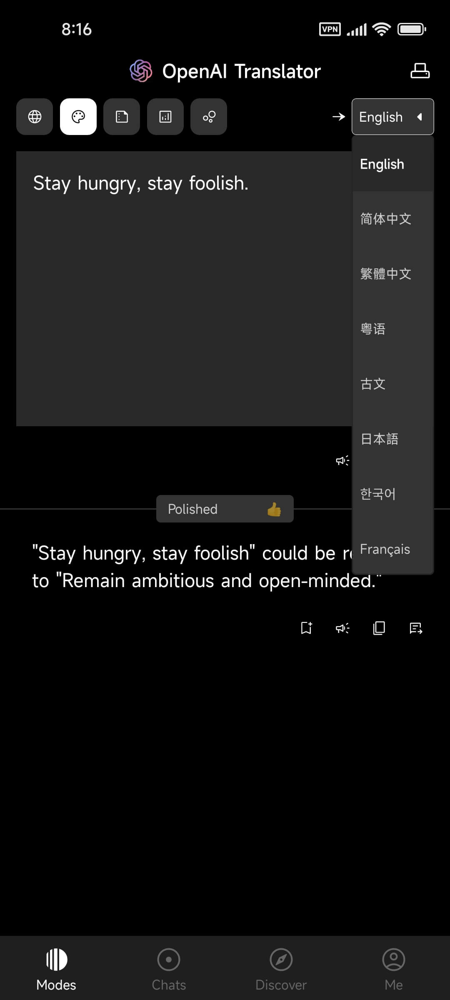</td>
    <td>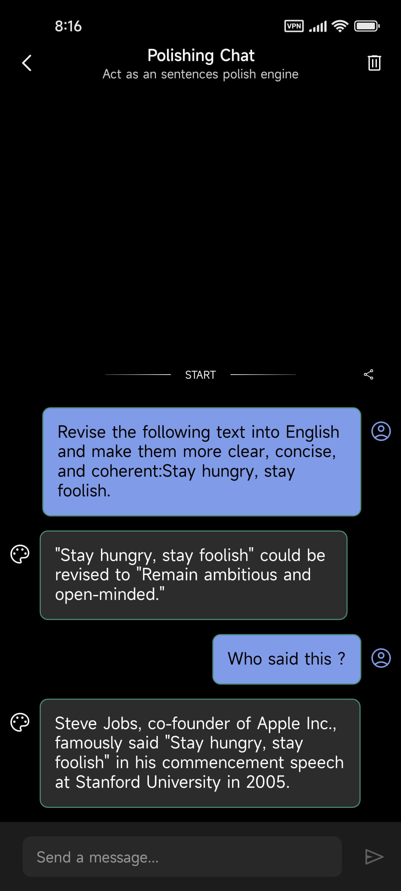</td>
    <td>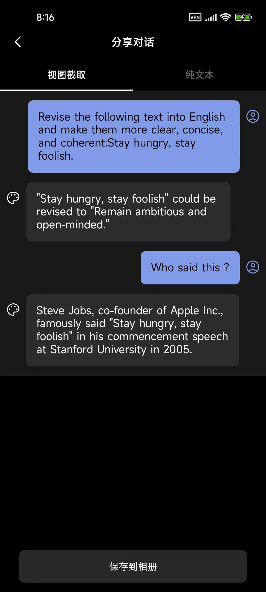</td>
    <td></td>
    <td>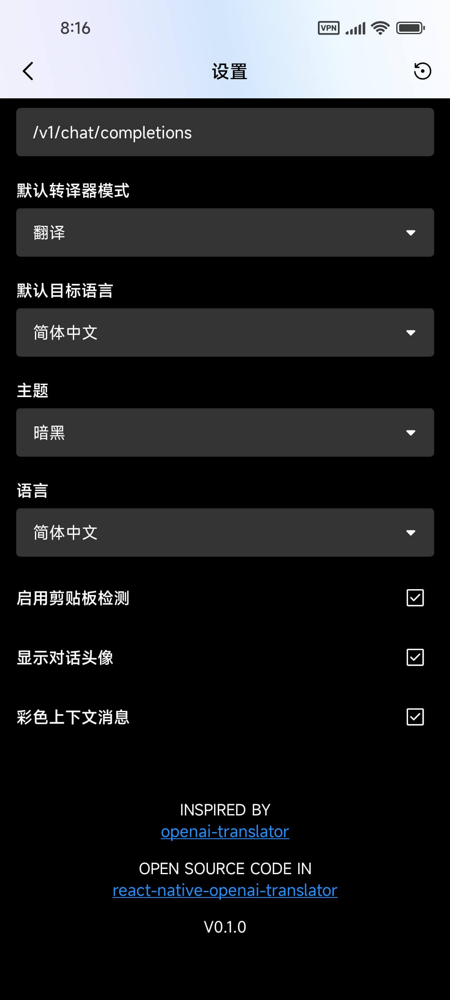</td>
  </tr>

  <tr>
    <td>English Word Records</td>
    <td>Create new Chat with your input</td>
    <td>Create new Chat from Awesome Prompts</td>
    <td>Customize the Chate you created</td>
    <td>Read Prompt Engineering Guide by url</td>
  </tr>
  <tr>
    <td>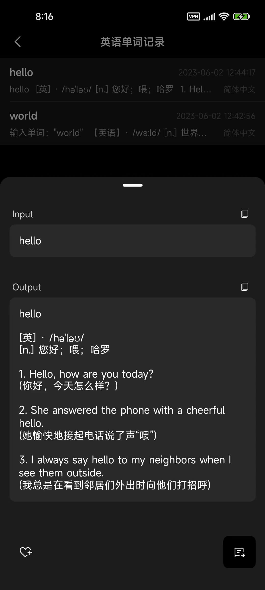</td>
    <td></td>
    <td>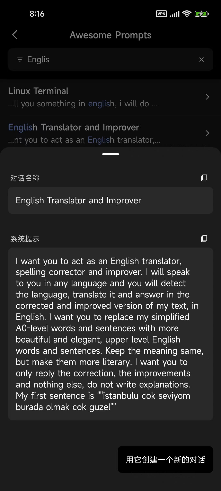</td>
    <td>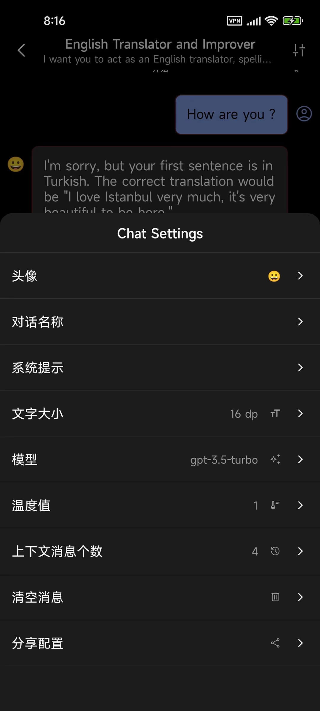</td>
    <td>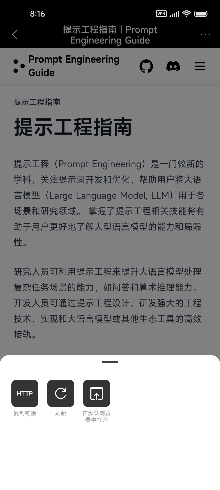</td>
  </tr>
</table>

> The screenshots above are all from v0.1.0, which is not the final version you are looking for.

## Rodemap

### Screens

- AITranslator
  - [x] Splash
  - [x] Main
    - [x] Modes
    - [x] Chats
    - [x] Discover
    - [x] Me
  - [x] Scanner
  - [x] Settings
  - [x] ModeChat
  - [x] CustomChat
  - [x] ShareDialogue
  - [x] PromptEngineeringGuide
  - [x] ModeWordCollections
  - [x] ModeResultCollections
  - [ ] ...

### To-Do List

- [x] feat: make translator-mode pageable in Modes screen
- [x] feat: support custom chat
- [x] feat: support 'view-capture' and 'text-shot' of a single dialogue
- [x] feat: support chat-persist by sqlite
- [ ] feat: support at least 5 user language
- [x] feat: provide an option to hide avatars in chat
- [ ] feat: double back-press to exit app on Android
- [x] feat: show app version in settings screen
- [ ] docs: how to contribute
- [ ] docs: how to build iOS app for personal use
- [x] docs: support show version name in Settings screen
- [x] ux: remove 'from-lang' in Modes screen for better user experience
- [x] ux: invert 'chat-list'
- [x] refactor: reimplement theme-setting by React Context

### Maybe To-Do List

- [ ] feat: support Azure OpenAI Service
- [ ] feat: support Azure TTS
- [ ] feat: support 'As keyboard everywhere'
- [ ] feat: support MarkDown preview by inner WebView
- [ ] feat: support 'Big Bang English-Word'
- [ ] fix: text-recognition-seems-not-stable on Android

## Development

### Res

- [google-icons](https://fonts.google.com/icons?icon.style=Rounded)
- [svg-to-react-native](https://transform.tools/svg-to-react-native)

### Libs

- [react-navigation](https://reactnavigation.org)
- [react-native-svg](https://github.com/software-mansion/react-native-svg)
- [react-native-reanimated](https://docs.swmansion.com/react-native-reanimated/docs/)
- [react-native-gesture-handler](https://docs.swmansion.com/react-native-gesture-handler/docs/)
- [react-native-mmkv](https://github.com/mrousavy/react-native-mmkv)
- [react-native-bottom-sheet](https://gorhom.github.io/react-native-bottom-sheet/)
- [react-native-safe-area-context](https://github.com/th3rdwave/react-native-safe-area-context)
- [react-native-clipboard](https://github.com/react-native-clipboard/clipboard)
- [react-native-view-shot](https://github.com/gre/react-native-view-shot)
- [react-native-quick-sqlite](https://github.com/margelo/react-native-quick-sqlite)
- [react-native-permissions](https://github.com/zoontek/react-native-permissions#readme)
- [@react-native-camera-roll/camera-roll](https://github.com/react-native-cameraroll/react-native-cameraroll)

### Note

- `react-native-vision-camera` do not support `react-native-reanimated v3`, so we should keep the version of reanimated at `^2.14.4`.

### Build Android

```bash
# 1. Clone the souce code
git clone git@github.com:zhuanghongji/react-native-openai-translator.git

# 2. Install node modules
cd react-native-openai-translator
yarn install

# 3.1 if `debug`
yarn run start
yarn run android

# 3.2 else if `release` by terminal.
# After the following two command, you can find the apk file in
cd android
./gradlew assembleRelease
```

```bash
# Tip 1:
# The applicationId of debug-apk will automatically be suffixed with `.dev` from that of the
# release-apk, so you run both debug-apk and release-apk in a single device.
# - application name of debug-apk: AIDev
# - application name of release-apk: AITranslator

# Tip 2:
# - To install the release-apk into you device, run the following commands:
cd ${your-project-parent-dir-path}/react-native-openai-translator/android/app/build/outputs/apk/release
# suggest installing the 64-bit version unless your device does not support it:
adb install AITranslator-arm64-v8a-[version_name].apk
# only install 32-bit below when your device unsupport 64-bit above
adb install AITranslator-armeabi-v7a-[version_name].apk

# Tip 3:
# - If you have experienced slow server-sent-event requests on Android during debugging,
#   there is no need to worry as they function properly in the release version.
```

### Build iOS

```shell
# To Be Done
```

## License

[GNU AFFERO GENERAL PUBLIC LICENSE](./LICENSE)
